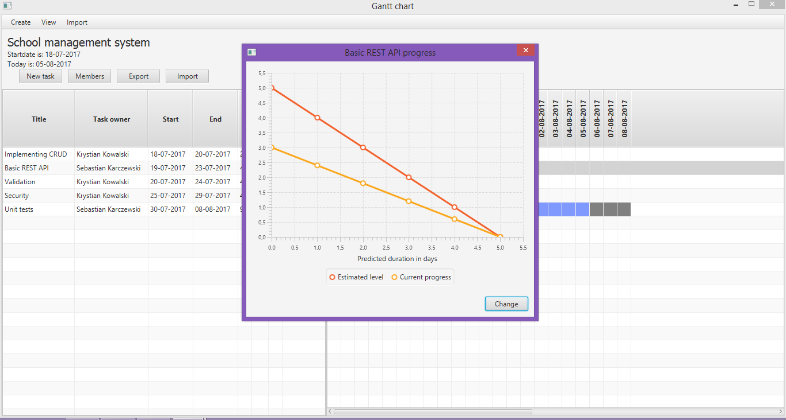

## Opis

Prosta aplikacja w javafx służąca do zarządzania zadaniami. Baza danych znajduje się na chmurze mongodb atlas.

## Funkcjonalności
> CRUD dla encji Person, Project, Assignment
> Pasek postępu w widoku jest zależny od zmiennej 'completed' w encji Assignment
> Eksportowanie danych do pliku w formacie JSON lub XML
> Importowanie danych z pliku w formacie JSON lub XML
> Wyświetlenie diagramu poglądowego dla postępu w realizacji zadania

## Screenshot

